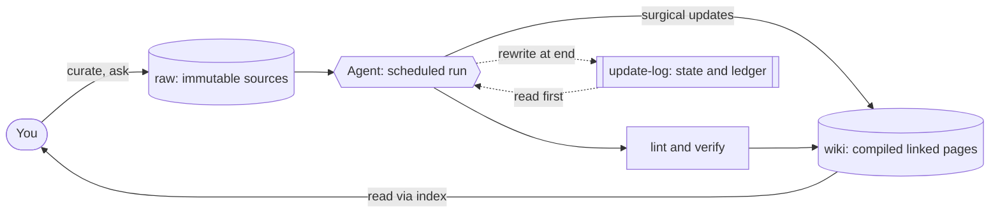

# 🧠 The Self-Maintaining Wiki

**A "second brain" an agent keeps current for you — a knowledge base that *compounds* instead of a pile of notes that rots.**

Most personal knowledge systems die of **maintenance, not bad ideas**. Collecting is easy; keeping fifty interlinked notes current is the work nobody does twice. This repo is a pattern that moves that work to a model: **you curate sources and ask questions; the agent files, links, summarises, reconciles — and checks its own work.**

> The throughline of every rule here: **the human owns judgment and the raw record; the agent owns the bookkeeping; the wiki is a compiled artifact that compounds.**

It started as a weekly-maintained Obsidian wiki on a fast-moving geopolitical-risk domain (~30 interlinked articles). This repo generalises that system — the run protocol, the file layout, the self-healing lint suite, and the token-budget model — so you can point it at *any* domain. (No domain content is included; see [Privacy](#privacy).)

---

## The idea in one diagram

**Compile, don't retrieve.** This is not RAG. RAG re-derives an answer from raw chunks on every query and accumulates nothing. Here, sources are *compiled once* into structured, linked pages, and questions are answered from the built artifact — so knowledge **compounds**.

---

## What's in this repo

| Path | What it is |
|---|---|
| [`skill/SKILL.md`](skill/SKILL.md) | The **run protocol** — the full, domain-agnostic prompt an agent executes each run (tiers, surgical updates, the lint suite, the verification loop, archival). Drop it into a scheduled task. |
| [`templates/`](templates/) | Skeletons for every file type: [article](templates/article.md), [index](templates/index.md), [glossary](templates/_canonical-names.md), [claims register](templates/_claims-verification.md), [update log](templates/_update-log.md), [weekly digest](templates/weekly-digest.md). |
| [`docs/principles.md`](docs/principles.md) | The nine ground rules (after Karpathy's *LLM-WIKI.md*) the system is built on. |
| [`docs/accuracy.md`](docs/accuracy.md) | The five **accuracy mechanisms** that were added on top: contradiction lint, entity canonicalization, the claims-verification register, source-anchoring, and the index-honesty probe. |
| [`docs/token-budget.md`](docs/token-budget.md) | How the system stays cheap: the two-tier run model, surgical-not-rewrite edits, archival hygiene, and scoped lint. |
| [`docs/case-study.md`](docs/case-study.md) | A sanitised before/after of running this on a real ~30-article wiki — what broke, what the checks caught, and the token savings. |
| [`examples/demo-vault/`](examples/demo-vault/) | A tiny skeleton vault showing the layout (placeholders only — no real content). |

---

## Quickstart (≈15 minutes)

1. **Make the two-layer vault.** Create an Obsidian vault (or any folder of Markdown). Inside it:
   - `raw/` — where you drop sources (PDFs, clippings, transcripts). **Never edited after they land.**
   - `wiki/` — where the agent writes compiled, linked pages. Copy the files from [`templates/`](templates/) in here (`_update-log.md`, `_canonical-names.md`, `_claims-verification.md`, an index, and your first article).
2. **Install the run protocol.** Put [`skill/SKILL.md`](skill/SKILL.md) where your agent reads instructions and edit the *Configuration* block at the top (paths, your domain, your source list, your cadence).
3. **Schedule it.** Point a scheduled agent run at it (e.g. weekly). Or run it by hand the first few times — early runs need supervision while naming conventions settle.
4. **Start small.** Ten sources, not ten thousand. Get *ingest → query → lint* feeling natural before you add a schema with twenty rules. A small wiki you actually feed beats a beautiful architecture you abandon in week three.

---

## Why it stays accurate

A graph that *looks* impressive can quietly rot. Five checks run every cycle to stop that — full detail in [`docs/accuracy.md`](docs/accuracy.md):

- **Contradiction lint** — finds the same fact stated two ways across pages. A contradiction is *information*, not an error to paper over: it tells you exactly where two sources disagree.
- **Entity canonicalization** — one canonical spelling per entity (people, orgs, places), enforced against a glossary, so facts don't fragment across `Hizbullah`/`Hezbollah`-style variants.
- **Claims-verification register** — every single-source or contested claim gets a tracked row and an *independent* second-source pass; claims are corroborated, contested, resolved, or retired — never left to drift.
- **Source-anchoring** — every substantive claim must trace to an immutable source in `raw/` or a cited URL. No anchor → flagged.
- **Index-honesty probe** — periodically asks whether the index still routes a real question to the right page. If it doesn't, the map has stopped matching the territory.

## Why it stays cheap

Maintaining a large wiki naively would burn tokens every week. The model stays within a tight budget — see [`docs/token-budget.md`](docs/token-budget.md):

- **Two-tier runs:** a *lightweight scan* by default; a *full sweep* only when new sources arrive or something significant breaks.
- **Surgical, not rewrites:** append dated update sections; never re-emit a 100KB article to change two sentences.
- **Archival hygiene:** old dated sections are split out to `archive/` so hot articles stay lean.
- **Scoped lint:** wiki-wide on a full sweep; on a light scan, just the touched articles plus the index.

---

## Privacy

This repo ships the **method, not the material**. There are no real article bodies, sources, or domain data — only the protocol, templates, docs, and placeholder skeletons. Keep your own `raw/` and `wiki/` content in a private vault; publish only the machinery.

## Credits

The nine ground rules adapt Andrej Karpathy's working notes on LLM-maintained knowledge bases (*LLM-WIKI.md*). The accuracy and token-budget layers were developed in practice on a live wiki. Built to run on any agent with file access and a scheduler (e.g. Claude in Cowork mode, Claude Code, or the Agent SDK).

## License

MIT — see [LICENSE](LICENSE). Ideas subject to revision as the models change.
